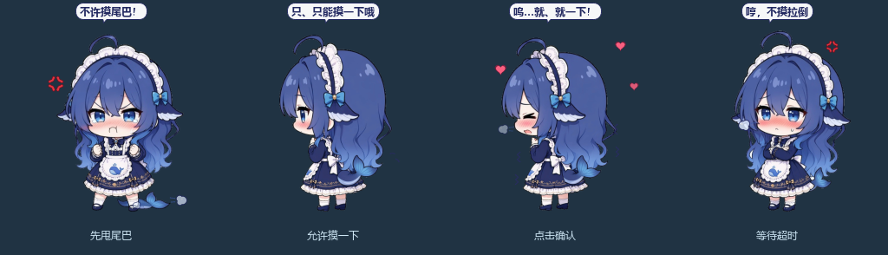
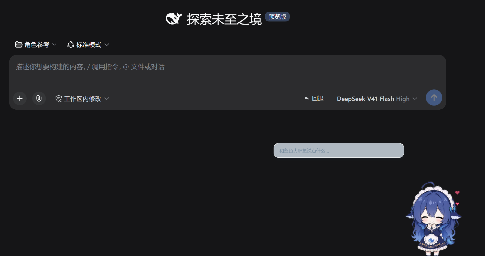
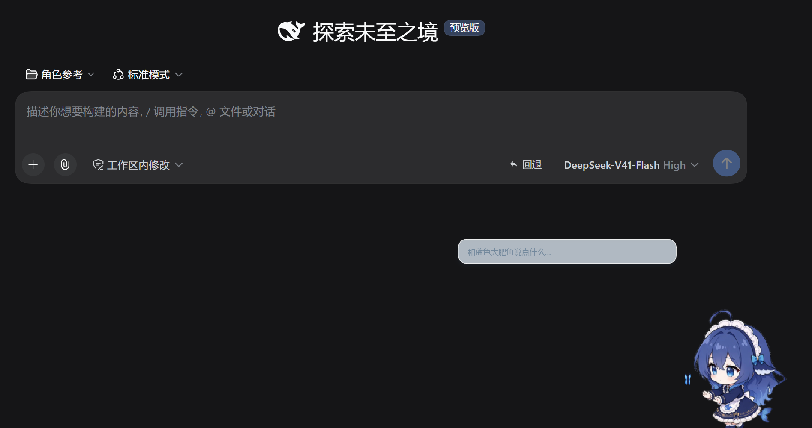

# 蓝色大肥鱼桌宠 / Blue Fat Fish Desktop Pet

一只透明、无边框的蓝色鲸鱼伙伴。可以独立陪伴，也可以跟随本机 DeepSeek Harness（dsh）的工作状态。



## 实机截图

<p>
  
  
</p>

## 开始使用

Windows 安装 Python 3.11 或更新版本，并让 Python 可从命令行使用。解压完整目录后，双击 **启动桌宠.bat**；首次启动会自动创建环境并安装 PySide6，需要网络。

- 单击摸头、双击开心；按住拖动，松开后落到屏幕底部。
- 点尾巴或右键「互动 → 摸尾巴」：先甩尾巴，再转身允许摸一下。等待约 4 秒，点她进入被摸分支；没有点击则进入超时分支。两个分支独立播放。
- 右键可以投喂、玩耍、改大小、切换安静陪伴、隐藏和退出。重复启动会召回已有实例。
- **打开桌宠对话.bat** 打开单行半透明输入框：回车发送，Alt + 拖动移动，右键设置，悬停查看反馈。
- 蓝色大肥鱼的日常回复直接显示在可换行气泡里，性格自然、呆萌，偶尔有点小傲娇；自然语言任务提交给 dsh，技术细节留在工作会话。可用 `/任务 ` 直接下指令、`/聊 ` 只聊天。
- 对话会触发相应表情和动作：被逗时脸红轻哼，被夸时害羞或得意，打招呼会挥手，也可以邀请摸头、摸尾巴、跳舞、喝茶。关键词命中直接反应；未命中时单独分类，与聊天回复并行。普通聊天保持默认动作，保护已有互动并限制重复播放。
- 日常聊天复用 dsh 配置的模型连接，独立调用并关闭思考，不创建 Harness 任务；AI 聊天需 dsh 正在运行，动画和本地互动可离线。
- `记住：称呼=主人` / `忘记：称呼` 管理明确保存的偏好，右键逐条查看或清除。详情见 [对话与记忆](docs/对话与记忆说明.md)。
- 独立模式指令：喂饭、睡觉、醒醒、安静、活泼、隐藏、散步、写代码、摸尾巴、摸头、开心。

macOS 可运行 `bash app/run_mac.command`；源码和素材通用，本次桌面与 dsh 联调在 Windows 验证。

## 连接 dsh

先安装并运行一次 DeepSeek Harness 桌面版，双击 **接入本地DSH.bat**，再双击 **启动DSH桌宠.bat**。安装脚本从当前用户的 `.dsh` 或 `DSH_HOME` 找配置，备份后添加可移除的插件段。

输入框右键选择 / 新建会话、设置工作目录、排队或插入当前工作、停止工作。许可和工具问题在 dsh 窗口中处理。运行时才会生成个人设置和本机连接凭据，这些文件不在源码包内。

工作会话挂到所选目录的 dsh 工作区，以「蓝色大肥鱼 · …」命名。明确指令提交成功后固定跟随；自动跟随只选当前目录。陪伴聊天通过三个只读工具读取裁剪的任务状态、进展与回复，输入有硬预算，排除原始 Harness 提示和工具日志。

动画跟随读取、搜索、修改、执行、思考、回复、委派、等待、限流、完成和失败。待机动作有冷却、防重复和轮换补偿。详情见 [状态与频率](docs/动画状态说明.md) 和 [dsh 使用说明](docs/DSH使用说明.md)。

## 记忆与隐私

- **分工**：日常聊天由蓝色大肥鱼单独快速回答（关闭思考），任务执行交给 dsh；详细分析、代码和工具输出留在 dsh 的工作会话。
- **本机保存**：聊天记忆保存在本机 `app/userdata/companion-memory.json`。近期聊天保留 7 天；长期记忆只在你明确输入 `记住：…` 时写入，可逐条忘记，也可清除近期聊天或长期记忆。个人记忆、会话、设置和运行时连接凭据不进入仓库和发布包。
- **发送给模型的内容**：闲聊通过 dsh 已配置的模型服务发出，每次只包含人设、当次输入、最近 12 条聊天与少量旧摘录、相关长期记忆，以及按需读取的裁剪任务摘要（状态、进展、回复），总输入最多 16000 字符。不发送系统 / 开发者提示、推理内容、工具参数、完整工具结果、文件正文、模型配置或凭据；常见凭据格式会先被隐藏。表情分类请求只看当次输入。
- 模型请求由你在 dsh 中配置的服务商处理，适用该服务商的数据政策；本项目不包含任何 API 密钥。详情见 [对话与记忆说明](docs/对话与记忆说明.md)。

## 开发与验证

应用使用 Python 标准库和 PySide6；dsh 桥接使用 Node.js 内置模块，由 dsh 加载，无须额外 npm 安装。

```powershell
py -3 -m venv .venv
.venv\Scripts\python.exe -m pip install -r app\requirements.txt
.venv\Scripts\python.exe app\whale_pet.py --mode standalone
.venv\Scripts\python.exe -m unittest discover -s app\tests -p "test_*.py"
.venv\Scripts\python.exe app\whale_pet.py --selftest --out selftest_out
```

桥接和陪伴模型测试（需要 Node.js）：`node --test app/tests/bridge.test.mjs app/tests/companion-chat.test.mjs`。

重新生成源码包：`python scripts/package_github.py`，输出到 `release/`。打包采用文件白名单，校验每个文件并附上 `MANIFEST.json`。

## 上传 GitHub

解压本包，把 `blue-fat-fish` 里面的文件作为仓库根目录上传，保留 `app/assets` 的全部文件。不要把外层 ZIP 当作源码目录；ZIP 可以放在 GitHub Release 供下载。

仓库包含启动器、源码、完整三页图集、76 帧写代码动画、60 帧摸尾巴允许动画、测试与说明；不含 Python 环境、会话、个人设置、连接凭据、历史原始 ZIP 或临时验证文件。素材来源记录见 [ASSETS.md](ASSETS.md)。

## 授权 / Credits

- **代码**（`app/` 里的 `.py` / `.mjs` / 脚本、`scripts/`、启动器、配置）：MIT License，见 [`LICENSE`](LICENSE)。
- **美术素材**（`app/assets/` 里的图集与图标、`app/assets/extra/` 里的序列帧、`docs/previews/` 里的预览图）：[CC BY-NC-SA 4.0](https://creativecommons.org/licenses/by-nc-sa/4.0/deed.zh-hans)，见 [`LICENSE-ART`](LICENSE-ART)。**禁止商用**。
- 本项目是 DeepSeek 鲸鱼娘 /「蓝色大肥鱼」形象的**二创（fan work）**：
  - 原设计：B站「上善无形」
  - 女仆版：B站 ZipZipPipe
  - 本项目三视图为基于 ZipZipPipe 女仆版的 AI 生成二创参考，所有动画帧由此制作（参考图不随仓库分发）。
- 角色形象的权利归原作者所有；上述授权只涵盖本项目自己制作的部分（动画、帧、程序）。如原作者有任何异议，请开 issue 联系，会及时处理。
- 与 DeepSeek（深度求索）官方**无任何关联**，也未获其认可或赞助；“DeepSeek”名称仅用于说明二创来源。
